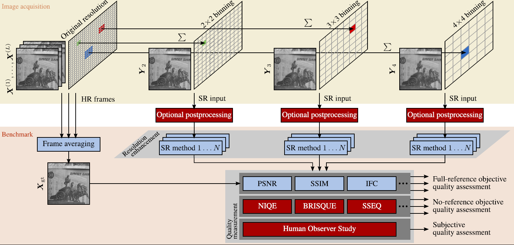

# Toward Bridging the Simulated-to-Real Gap: Benchmarking Super-Resolution on Real Data

This repository contains the evaluation protocols for the **Super-Resolution Erlangen (SupER)** benchmark reported in our paper:

> Köhler, T., Bätz, M., Naderi, F., Kaup, A., Maier, A., & Riess, C. (2019). "Toward Bridging the Simulated-to-Real Gap: Benchmarking Super-Resolution on Real Data.", In: IEEE Transactions on Pattern Analysis and Machine Intelligence (to appear) [[PDF]](https://ieeexplore.ieee.org/document/8716546)

All datasets and the results from the benchmark can be downloaded from our [project webpage](https://superresolution.tf.fau.de/). The images are all-real acquisitions collected with a Basler acA2000-50gm CMOS camera equipped with a f/1.8, 16mm fixed-focus lens. We benchmarked various single-image and multi-frame super-resolution (SR) methods on this database.



## Getting started

The structure for the benchmark is as follows:

- `data`: directory designated for storing the input datasets
- `matlab`: source code for the benchmark
	- `algorithms`: SR algorithms and image quality measures
	- `quantitativeStudy`: scripts for quantitative evaluation
	- `observerStudy`: scripts of the human observer study
	- `utility`: image IO and preprocessing functions
	- `visualization`: scripts to visualize benchmark results
- `results`: directory designated for storing the evaluation results

You can use our evaluation framework as follows:

- Clone this repository:
	```git clone https://github.com/thomas-koehler/SupER.git```
- Download the SupER datasets comprising ground truth images and their low-resolution counterparts from the [project webpage](https://superresolution.tf.fau.de/) into the `data` folder 
- Download the result data from the [project webpage](https://superresolution.tf.fau.de/) into the `results` folder. 

The `data` folder already contains the configurations for all datasets and evaluations (names of the processed sequences and coordinates of the image patches) stored as MAT-files. In case you leave `results` empty, you can compute all results from our data using our evaluation protocols. 

## Algorithms

Our repository contains source codes of the following algorithms grouped into single-image and multi-frame SR. Provided third party codes are shared with permission of the authors. 

| ID | Method | Reference | Single-image | Multi-frame |
|  ---  |  ---  | --- |  ---  | --- |
| 1  | **EBSR** | [Kim and Kwon, Single-image super-resolution using sparse regression and natural image prior](https://ieeexplore.ieee.org/abstract/document/5396341) | x ||
| 2  | **ScSR** | [Yang et al., Image super-resolution via sparse representation](https://ieeexplore.ieee.org/abstract/document/5466111) | x ||
| 3  | **NBSRF** | [Salvador and Perez-Pellitero, Naive Bayes super-resolution forest](http://openaccess.thecvf.com/content_iccv_2015/papers/Salvador_Naive_Bayes_Super-Resolution_ICCV_2015_paper.pdf) | x ||
| 4  | **VSRNet** | [Kappeler et al., Video super-resolution with convolutional neural networks](https://ieeexplore.ieee.org/abstract/document/7444187) | | x |
| 5  | **NUISR** | [Park et al., Super-resolution image reconstruction: a technical overview](https://ieeexplore.ieee.org/abstract/document/1203207) | | x |
| 6  | **WNUISR** | [Bätz et al., Multi-image super-resolution using a dual weighting scheme based on Voronoi tessellation](https://ieeexplore.ieee.org/abstract/document/7532874) | | x |
| 7  | **HYSR** | [Bätz et al., Hybrid super-resolution combining example-based single-image and interpolation-based multi-image reconstruction approaches](https://ieeexplore.ieee.org/abstract/document/7350759) | | x |
| 8  | **DBRSR** | [Bätz et al., Multi-image super-resolution using a locally adaptive denoising-based refinement](https://ieeexplore.ieee.org/abstract/document/7813343) | | x |
| 9  | **SRB** | [Ma et al., Handling motion blur in multi-frame super-resolution](https://www.cv-foundation.org/openaccess/content_cvpr_2015/papers/Ma_Handling_Motion_Blur_2015_CVPR_paper.pdf) | | x |
| 10 | **L1BTV** | [Farsiu et al., Fast and robust multiframe super resolution](https://ieeexplore.ieee.org/abstract/document/1331445) | | x |
| 11 | **IRWSR** | [Köhler et al., Robust multi-frame super-resolution employing iteratively re-weighted minimization](https://ieeexplore.ieee.org/abstract/document/7378486) | | x |
| 12 | **NN** | Nearest-neighbour interpolation | x ||
| 13 | **BICUBIC** | Bicubic interpolation | x ||
| 14 | **BVSR** | [Liu et al., On Bayesian adaptive video super resolution](https://ieeexplore.ieee.org/abstract/document/6549107) | | x |
| 15 | **SRCNN** | [Dong et al., Learning a deep convolutional network for image super-resolution](https://link.springer.com/chapter/10.1007/978-3-319-10593-2_13) | x ||
| 16 | **BEPSR** | [Zeng and Yang, A robust multiframe super-resolution algorithm based on half-quadratic estimation with modified BTV regularization](https://www.sciencedirect.com/science/article/pii/S1051200412001613) | | x |
| 17 | **SESR** | [Huang et al., Single image super-resolution from transformed self-exemplars](https://www.cv-foundation.org/openaccess/content_cvpr_2015/papers/Huang_Single_Image_Super-Resolution_2015_CVPR_paper.pdf) | x ||
| 18 | **DRCN** | [Kim et al., Deeply-recursive convolutional network for image super-Resolution](http://openaccess.thecvf.com/content_cvpr_2016/papers/Kim_Deeply-Recursive_Convolutional_Network_CVPR_2016_paper.pdf) | x ||
| 19 | **VDSR** | [Kim et al., Accurate image super-resolution using very deep convolutional networks](https://www.cv-foundation.org/openaccess/content_cvpr_2016/papers/Kim_Accurate_Image_Super-Resolution_CVPR_2016_paper.pdf) | x ||
| 20 | **A+** | [Timofte et al., A+: Adjusted anchored neighborhood regression for fast super-resolution](https://link.springer.com/chapter/10.1007/978-3-319-16817-3_8) | x ||

For benchmarking the SR algorithms, we use the following full-reference and no-reference image quality measures:

| ID | Method | Reference | Full-reference | No-reference |
|  ---  |  ---  |  ---  | --- | --- |
| 1  | **PSNR** | Peak-signal-to-noise ratio | x | |
| 2  | **SSIM** | [Structural similarity index](http://live.ece.utexas.edu/research/Quality/index_algorithms.htm) | x | |
| 3  | **M-SSIM** | [Multi-scale structural similarity index](http://live.ece.utexas.edu/research/Quality/index_algorithms.htm) | x | |
| 4  | **IFC** | [Information fidelity criterion](http://live.ece.utexas.edu/research/Quality/index_algorithms.htm) | x | |
| 5  | **S3** | [Spectral & spatial measure of local perceived sharpness](http://vision.eng.shizuoka.ac.jp/s3/) | | x |
| 6  | **BRISQUE** | [Blind/Referenceless image spatial quality evaluator](http://live.ece.utexas.edu/research/Quality/index_algorithms.htm) | | x |
| 7  | **SSEQ** | [Spatial/spectral entropy-based quality index](http://live.ece.utexas.edu/research/Quality/index_algorithms.htm) | | x |
| 8  | **NIQE** | [Naturalness image quality evaluator](http://live.ece.utexas.edu/research/Quality/index_algorithms.htm) | | x |
| 9  | **SRM** | [No-Reference quality metric for single-image super-resolution](https://sites.google.com/site/chaoma99/sr-metric) | | x |
| 10 | **LPIPS** | [Learned perceptual image patch similarity](https://github.com/richzhang/PerceptualSimilarity)| x | |


## Evaluation protocols for quantitative study

All evaluation scripts can be found in `matlab/quantitativeStudy``. In its current version, the benchmark is divided into six types of experiments performed on different datasets:

- **Baseline:** experiments on global motion, local motion, and mixed motion data
- **Photometric outlier:** robustness analysis with photometric outliers
- **Compression:** robustness analysis for video compression (H.265/HEVC coding)
- **Sequence length:** influence of the number of input frames to multi-frame SR
- **Simulated data:** subset of the baseline experiments but using software binning (bicubic downsampling) to obtain low-resolution images
- **Computation time:** subset of baseline experiments with evaluation of computation time
 

### Specifying the evaluation parameters

The `initEvaluationParametersFor<DATASET>` define the parameters used for our benchmark, where `<DATASET>` denotes one of the aforementioned experiments (baseline, photometric, compression, sequence length, computation time, simulated data). The parameters comprise:

- Selected scenes/sequences from the datasets used for the respective experiments
- Range of used binning factors and compression levels for low-resolution input data
- Number of frames within an input image sequence with the definition of sliding windows (for multi-frame SR only)
- The algorithms included in the respective evaluation defined by their method IDs

You can modify the evaluation parameters by changing these script. For instance, for the baseline evaluation the parameters in `initEvaluationParametersForBaseline` are set as follows:

```matlab
% Range of binning factors used for this evaluation.
binningFactors = [2, 3, 4];
% Range of compression levels (index 1 means uncoded; indices 2-5 mean 
% coded with the corresponding QP setting using H.265/HEVC coder.
compressions   = [NaN, 10, 20, 30, 40];
% Range of number of frames for SR at the different binning factors.
numberOfFrames = [5, ...    % Number of frames for binning factor 2
                  11, ...   % Number of frames for binning factor 3
                  17];      % Number of frames for binning factor 4
% Index of the first reference frame for sliding window processing.
startReferenceFrame = 9;

% ----- Settings considered for this evaluation -----
% This is the index of the SR method that is evaluated.
sr_method           = 0:length(SRMethods);
% This is the index of the binning factor that is evaluated.
binning_val         = 1:3;
% This is the index of the compression setting.
compress_val        = 1;
% This is the index that indicates the number of input frames.
numberOfFrames_val  = 1;
% This is the index of the scene according to datasets.mat.
scenes_val          = 1:127;
% This is the index of the sliding window that is evaluated.
sliding_val         = 1:10;
```

By default, all parameters are set to reproduce the results reported in our paper and all available SR methods are included. You can modify the parameters to add new scenes/sequences or to include new algorithms (see below).

### Running the evaluations

The `evaluate<DATASET>` scripts implement our different evaluation protocols. Run these scripts to process the given input data and to compute the SR images using the different algorithms. In case of the baseline experiments, the benchmark is performed by setting the input data, the result directory as well as all evaluation parameters as follows:

```matlab
% Path to input data and result directory.
inputDir = '../../data';
datasetConfig = 'baselineDatasets';
resultDir = '../../results/baselineDatasets';

% Parameters for this evaluation.
initEvaluationParametersForBaseline;

%% Start evaluation.
processDatasets(inputDir, datasetConfig, resultDir, 
	binningFactors, numberOfFrames, startReferenceFrame, 
	numberOfFrames_val, sliding_val, sr_method, binning_val, scenes_val, 
	compressions(compress_val));
```

You can modify the path to the input and the results if desired. `processDatasets` defines the actual processing pipeline.

Once the SR result images are computed, the `evaluateQualityMeasuresFor<DATASET>` can be used to calculate the different image quality measures from these images. For the baseline experiments, the quality measures can be calculated as follows:

```matlab
% The quality measures that are calculated.
measure_val = 1:length(qualityMeasures);

% Size of the border in pixels that is cropped from super-resolved image to 
% evaluate the quality measures without distortion by boundary artifacts.
border = 3;

%% Start evaluation.
calculateQualityMeasures(inputDir, datasetConfig, resultDir, 
	binningFactors, numberOfFrames, numberOfFrames_val, sliding_val, sr_method,
	binning_val, scenes_val, compressions(compress_val), measure_val, border);
```

By default, the script calculates all measures (`measure_val = 1:length(qualityMeasures)`) cropping a three-pixel boundary from the SR images as described in the paper. You can also limit the evaluation to specific measures by changing `measure_val`.

### Handling of the results

All results (SR images and quality measures) are stored in the `results` folder. These items are sorted by the different datasets, scenes, and image compression levels with the directory structure `<DATASET>/<SCENE>/<COMPRESSION_LEVEL>`. The data is organized to facilitate a parallel execution of our scripts. There is one MAT-file for each result image and quality measure such that all items can be computed independently from each other. 

The SR images for a certain dataset, scene and compression level are stored in the `mat` subfolders with the naming convention:

	<MOTION_TYPE>_<BINNING_FACTOR>_sr<METHOD_INDEX>_f<NUMBER_OF_FRAMES>_win<SLIDING_WINDOW_INDEX>.

The corresponding quality measures are stored in `quality_qm<MEASURE_INDEX>` subfolders with the naming convention: 

	<MOTION_TYPE>_<BINNING_FACTOR>_sr<METHOD_INDEX>_f<NUMBER_OF_FRAMES>_win<SLIDING_WINDOW_INDEX>_qm<MEASURE_INDEX>. 

You can call the `getQualityMeasuresFromResults` function in `visualization` to import specific benchmark results. For instance, to filter for the results from the global motion with translation in z-direction datasets without video coding considering all scenes, SR methods, binning factors and sliding windows, you can run:

```matlab
inputDir = '../../data';
resultDir = '../../results';

motion = {'global_translation_z_inlier'};
compression = {'Uncoded'};
binningFactors = [2, 3, 4];
numberOfFrames = [5, 11, 17];
srMethods = 1:length(SRMethods);
slidingWindows = 1:10;

% Get SR results with quality measures.
srResults = getQualityMeasuresFromResults([resultDir, '/baselineDatasets'], {},
	motion, compression, binningFactors, srMethods, numberOfFrames, slidingWindows);
```

The `srResults` structure comprises the quality measures for all imported datasets. You can plot these results using our visualization scripts (see below).

### How to add new data

The input data for the benchmark is described in the `data` folder. For each evaluation, the respective input data is defined in a MAT-file with the following attributes:

- Name of the scene
- Name of the motion type
- Position of the processed image patches in the format `(startColumn, startRow, width, height)` defined in image coordinates of the ground truth. Note that `width` and `height` must be divisible by all binning factors to ensure that the sizes of all low-resolution images are integer.

To extend the benchmark, you can add new data in these MAT-files.

### How to add new algorithms

The available SR algorithms are listed in `algorithms/SRAlgorithms/SRMethods.m`. Including a new algorithm can be done as follows:

- Add a new entry to the array defined in that file. The algorithms are associated with a unique index corresponding to their position in that array.
- Use the `SRMethodConfig` structure to assign a unique name and a type (single-image SR or multi-frame SR). Also you can be specify if the method requires motion estimation and how the pixel coordinate system is defined (sampling at the center point or the top-left corner of the pixel). 
- Implement a new function `superresolve_<NAME>` in `algorithms/SRAlgorithms`, where name `<NAME>` denotes the unique name of the algorithm. It can contain the actual source code or can be a wrapper for the implementation.

The parameters required by each algorithm are 1) the magnification factor, and 2) a sliding window structure including the input frames as well as a reference frame. In case of multi-frame SR, all input frames are registered towards the reference using optical flow. In case of single-image SR, only the reference frame is processed (see our paper for details). 

### How to add new image quality measures

The image quality measures are listed in `algorithms/qualityMeasures/qualityMeasures.m`. Including a new measure can be done as follows:

- Add a new entry to the array defined in this file. Each measure is associated with a unique index that is equal to its position in that array.
- Implement a new function `imageQuality_<NAME>`, where name `<NAME>` denotes the unique name of the quality measure. It can contain the actual source source code for the measure or can be a wrapper for the implementation.

Each quality measure takes a single SR image and the ground truth as inputs. In case of a no-reference measure, only the SR image is used while the ground truth is ignored.

## Evaluation protocols for human observer study

All evaluation protocols of the human observer study are included in `observerStudy`. The study was performed for the uncoded global motion, local motion, mixed motion, and photometric outlier datasets with the binning factors 2, 3, and 4. All results are provided in `results/observerStudy/voting.mat`. The voting comprises a list of **force-choice pair-wise comparisons**. Each entry comprises 50 image pairs (SR images computed by two algorithms) and corresponds to the voting obtained from one observer. A single pair has the following structure:

- Name of the scene, motion type, environmental condition, and binning factor considered in that pair
- The names of the first and the second image including the compared SR algorithms
- The voting of the observer for that pair:
	- 1: the first image was preferred
	- 2: the second image was preferred
- The reasons for the voting requested from the observer:
	- 1: "This image is sharper"
	- 2: "This image has less motion artifacts"
	- 3: "This image has less noise"
	- 4: "This image is NOT over-sharpened"
	- 5: "This image is simply more appealing; There is no specific reason"
	- 6: "I don't know which image is better; I can't tell the difference"
- A flag to indicate if the pair corresponds to real comparison of two algorithms (0) or to a sanity check (1)

### Fit Bradley-Terry model

To fit the **Bradley-Terry (BT) model** from the observer study, run the `evaluateBTScores` script. This calculates BT scores from force-choice pair-wise comparisons (`voting.mat`) for each scene, motion type, environmental condition, and binning factor. You can specify the maximum number of sanity checks an observer is allowed to fail (default: 1). Observers that fail more sanity checks are rejected. All remaining observers are used to fit the BT model. The calculated BT scores with meta information (name of the scene, motion and environment conditions, binning factor) are stored in `results/observerStudy/btModel.mat`.

The correlation analysis to our quantitative study can be performed by running `evaluateQualityMeasureCorrelations`. This uses the precomputed BT model and computes the weighted Kendall distance between these scores and the different image quality measures. Results are stored in `results/observerStudy/qualityMeasureCorrelation.mat`.

The trade-off between perceptual image quality and SR computation time can be evaluated by running `evaluateQualityTimeTradeoff`. This relates the mean BT score achieved by the different SR algorithms to their respective computation times. Results are stored in `results/observerStudy/qualityTimeTradeoff.mat`.

### Inter-observer variances, convergence, and correlation analysis

To analyze inter-observer variances from the observer study, run `evaluateCoefficientOfAgreement`. This calculates the Kendall coefficient of agreement from the BT model for all binning factors and different environmental conditions. Results are stored in `results/observerStudy/coefficientsOfAgreement.mat`.

To evaluate convergence, run `evaluateObserverStudyConvergence`. This evaluates inter-observer variances by randomly sampling subsets of the votes from all force-choice pair-wise comparisons (`voting.mat`). The evaluation is performed for different numbers of sanity checks that are allowed to fail by an observer. Results are saved in `results/observerStudy`/observerStudyConvergence.mat`.

## Visualization

We provide different scripts to visualize the benchmark results in `visualization`. All results should be precomputed as described above before running the visualization.

To plot all results from our quantitative study run `plotQualityMeasures`. This reproduces Figures 5 - Figure 11 from our paper. You can modify the visualization by adding own SR algorithms or image quality measures.

To plot the results from the human observer study run `plotObserverStudy`. This reproduces Figure 12 - Figure 16 from the paper.   


## Citation

If you use our datasets and source codes for your research, please cite our paper:

    @article{Koehler2019,
        author  = {K{\"o}hler, Thomas and B{\"a}tz, Michel and Naderi, Farzad and Kaup, Andr{\'e} and Maier, Andreas and Riess, Christian},
        title   = {Toward Bridging the Simulated-to-Real Gap: Benchmarking Super-Resolution on Real Data}, 
        journal = {IEEE Transactions on Pattern Analysis and Machine Intelligence},
        year    = {2019},
	    volume  = {}, 
	    number  = {}, 
	    pages   = {1-1},
	    doi     = {10.1109/TPAMI.2019.2917037}, 
	    ISSN    = {0162-8828}
    }
	

## Acknowledgements

We would like to thank all authors who contributed source codes for SR algorithms or image quality measures to this evaluation framework.
